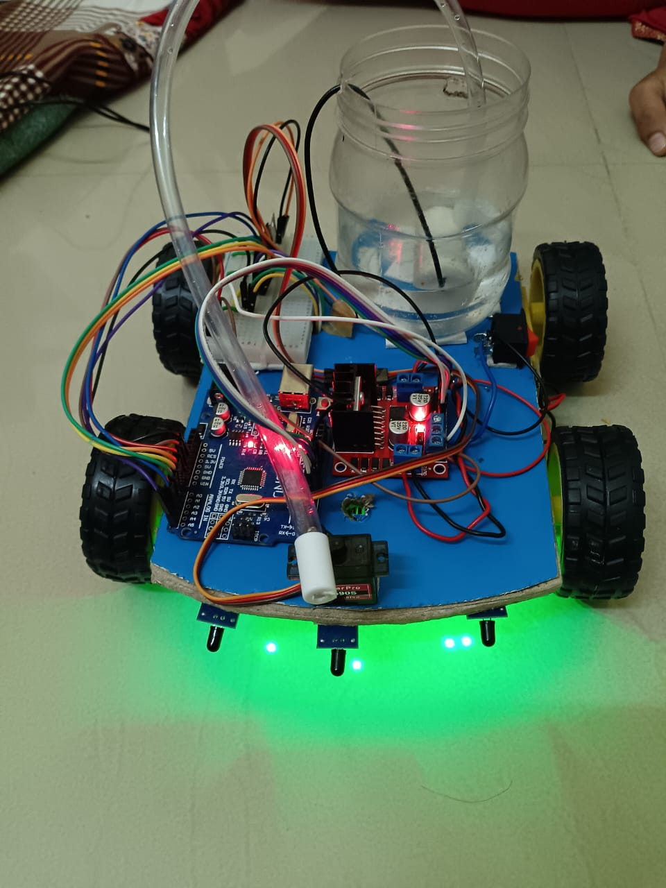
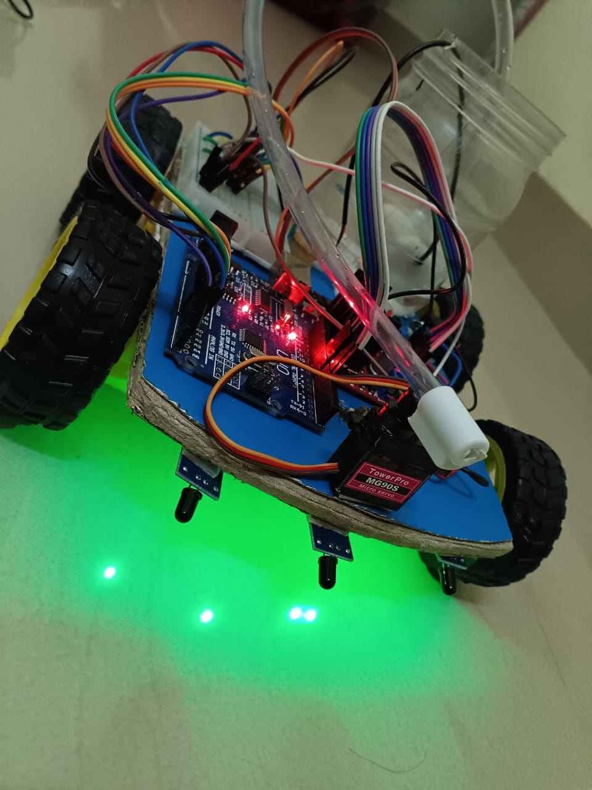
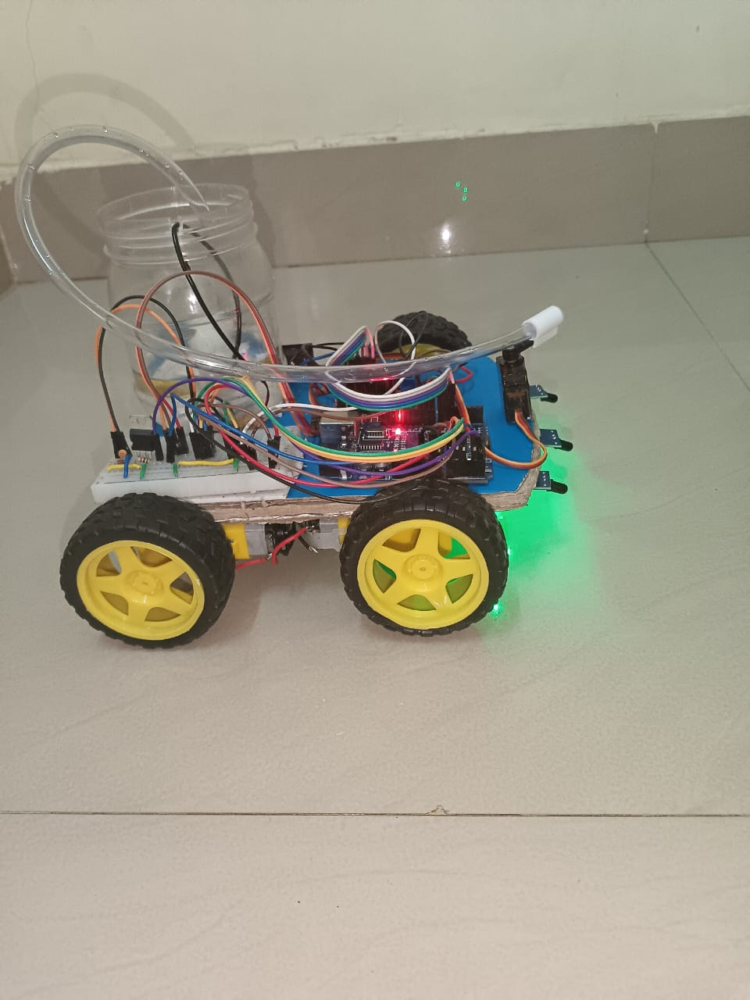

# Firefighter Robot 

An Arduino-based firefighting robot that uses three flame sensors to detect the direction of a fire source. The robot automatically moves towards the flame and activates a water pump through a servo controlled mechanism to extinguish the fire.

## Features

- Automatic flame detection using IR flame sensors
- Direction-based fire source identification
- Autonomous robot movement
- Automatic water spraying mechanism
- Arduino UNO based control system
- Low-cost embedded systems project

## Components Required

1. IR 4-Pin Flame Sensors × 3
2. Arduino UNO
3. Robot Chassis
4. BO Motors × 4 (with Wheels)
5. L298N Motor Driver
6. Solder-less Breadboard
7. Mini Servo Motor
8. 5–9V Water Pump with Pipe
9. Water Tank / Bottle
10. 3.7V 18650 Batteries × 2
11. Jumper Wires
12. TIP122 Transistor
13. 104pF Capacitor
14. 1kΩ Resistor

## Working Principle

1. The three flame sensors continuously monitor the surroundings for fire.
2. Arduino UNO processes the sensor readings.
3. The robot identifies the direction of the flame.
4. The robot moves toward the fire source using BO motors controlled by the L298N motor driver.
5. The servo motor positions the water pipe toward the flame.
6. The water pump is activated automatically.
7. Water is sprayed to extinguish the fire.

## Circuit Diagram

The complete circuit diagram is available in:

`circuitdia.jpeg`

## Project Images

### Firefighter Robot

### Hardware Setup

### Working Model

## Files Included

- `firefighter-Rbcode.ino` – Arduino source code
- `circuitdia.jpeg` – Circuit diagram
- `images/` – Project photographs

## Applications

- Fire detection and extinguishing systems
- Safety robotics
- Embedded systems projects
- Arduino-based automation
- Educational robotics

## Future Enhancements

- IoT-based monitoring and control
- GSM/SMS fire alerts
- Obstacle avoidance system
- Camera-based fire detection
- Mobile app integration

## Author
Sheeba Maheen
https://www.linkedin.com/in/sheeba-maheen-954b2237b

B.Tech in Electronics and Computer Engineering
